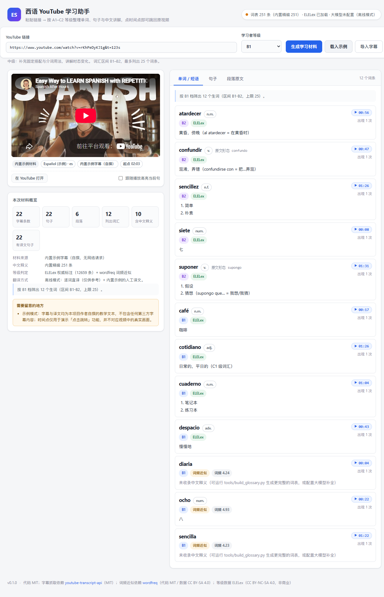
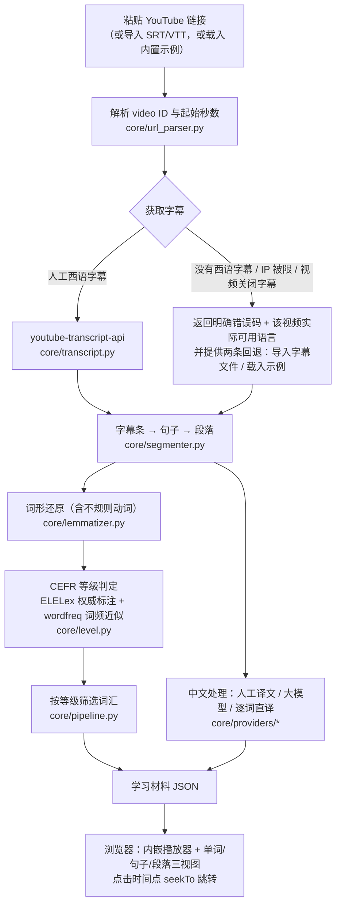

# 西语 YouTube 学习助手 · Spanish YouTube Learner

**粘贴一个 YouTube 链接 → 自动整理出按 A1–C2 等级筛选的单词表、逐句西语原文与中文讲解，每个句子/单词都带时间点按钮，点一下就能跳回原视频对应位置。**

一个面向西班牙语初学者的轻量 Web 工具：本地运行、无需注册、无字幕时给清楚的原因和替代方案、默认不调用任何大模型也能完整工作。

<p align="center">
  
</p>

---

## 它解决什么问题

看西语视频时最常见的困境：字幕滚得太快、生词不知道意思、想回听某个词却找不到位置。
本工具把「一段字幕」变成「一份可对照、可跳转的学习材料」：

* **单词 / 短语清单**——只列符合你当前等级的词，带中文释义、词性、出现次数与首次出现时间；
* **逐句西语原文**——附中文翻译与逐词直译，重要句子带语法/语域讲解；
* **整段原文**——按停顿自动合并成段落，方便通读；
* **时间点跳转**——点 `▶ 00:45`，右侧播放器直接跳到那一秒。

## 核心流程



## 快速开始（Windows，可复现）

```bat
:: 1. 克隆后进入目录
cd spanish-yt-learner

:: 2. 建虚拟环境（Python 3.9+）
python -m venv .venv
.venv\Scripts\activate

:: 3. 安装依赖
pip install -r requirements.txt

:: 4. 启动
python app.py
```

然后打开 <http://127.0.0.1:5000/>，页面会预填一个默认测试链接。

**不需要任何密钥。** 第一次建议先点「**载入示例**」——内置了一段自撰的教学字幕
（含人工中文译文与示例词表），**完全不联网**即可体验全部界面功能。

### 三种使用方式

| 方式 | 操作 | 适合 |
| --- | --- | --- |
| YouTube 链接 | 粘贴链接 → 「生成学习材料」 | 视频带西语字幕时 |
| 导入字幕 | 「导入字幕」选 `.srt` / `.vtt` 文件（可同时填链接以启用跳转） | 视频没有西语字幕，但你在别处找到了字幕 |
| 内置示例 | 「载入示例」 | 快速体验界面、断网演示 |

### 学习者等级（A1–C2）

切换右上角等级下拉框会**立即按新等级重新整理**材料：

| 等级 | 词汇区间 | 最多列出 | 讲解深度 |
| --- | --- | --- | --- |
| A1 | A1–A2 | 15 | 最精简 |
| A2 | A2–B1 | 20 | 基础 |
| B1 | B1–B2 | 25 | 标准搭配/时态 |
| B2 | B2–C1 | 30 | 搭配、语域、近义辨析 |
| C1 | C1–C2 | 40 | 习语、语气、文体 |
| C2 | C2–超纲 | 50 | 只列生僻词 |

等级判定的优先级：**ELELex 权威 CEFR 标注**（14,290 词，A1–C1）→
未收录的词回退到 **wordfreq 词频近似**（Zipf 值映射到档位，界面会标注「词频近似」以示区别）。

### 翻译来源与回退链

整句译文按**三级回退链**获取，逐级自动降级、绝不阻塞流程：

| 优先级 | 来源 | 需要配置 | 界面徽标 |
| --- | --- | --- | --- |
| 1 | 大模型（OpenAI 兼容接口） | `.env` 填三项 | 「AI 译文」（可按等级调整译文风格） |
| 2 | MyMemory 免费机翻 | 无需任何配置 | 「机翻译文」（匿名约 5000 字符/天，`MYMEMORY_EMAIL` 可提升） |
| 3 | 内置词表逐词直译 | 无 | 「近似直译」（仅供参考） |

接入大模型（可选）：

```bat
copy .env.example .env
:: 编辑 .env，填入 LLM_BASE_URL / LLM_API_KEY / LLM_MODEL
python app.py
```

工程细节（都可在 `.env.example` 调整）：

- **并发翻译**：多句并发请求（默认 4 线程，`LLM_CONCURRENCY` 可调），长视频也能在一两分钟内完成；
- **失败重试**：限流（429）与服务端错误自动退避重试（最多 3 次尝试，`LLM_TIMEOUT` 控制单句超时）；
- **结果缓存**：同一句子（同等级）只翻译一次，重复出现不重复计费；
- **逐级回退**：大模型失败 → MyMemory 机翻 → 离线直译，失败句子在警告区汇总提示。

**密钥只从环境变量或 `.env` 读取**（`.env` 已被 `.gitignore` 排除），不会写进代码，
接口响应与日志中一律脱敏。修改 `.env` 后需重启服务生效。

### 可选：生成更完整的西汉词表

仓库自带的精编词表约 251 条，保证开箱即用。想要更完整的覆盖，二选一：

```bat
:: 路线 A（推荐，轻量）：用你自己的大模型，为当前视频里的生词补中文释义
set LLM_BASE_URL=https://api.openai.com/v1
set LLM_API_KEY=你的密钥
set LLM_MODEL=gpt-4o-mini
python tools/build_glossary.py --from-llm --srt 你的字幕.srt

:: 路线 B（重型，无需密钥）：流式处理 kaikki.org 英文词典 dump（约 3.1 GB）
python tools/build_glossary.py --from-kaikki
```

> **为什么是「英文词典 dump」？** 英文维基词典只有英语词条页带跨语言 Translations
> 区块；西语词条页（kaikki 的 Spanish dump，1.05 GB）完全不含 `translations` 字段
> （已实测验证）。因此西→中词表只能通过英语义项做枢纽对齐得到。
> 路线 B 边下载边解析、不落盘 3.1 GB，可用 `--max-bytes 200000000` 先试跑。

---

## 运行测试

```bat
pip install -r requirements-dev.txt
pytest tests/ -q
```

当前 **191 个测试全部通过**，覆盖：链接解析、SRT/VTT 解析、句子切分、
词形还原（含不规则动词）、CEFR 等级判定、词表合并、离线/大模型提供方、
示例流水线（六档等级）、Flask 接口（含全部错误路径）、以及**许可合规守护**
（见下节）。

---

## 许可证（请务必阅读这一节）

**本仓库的源代码是 MIT**，见 [`LICENSE`](./LICENSE)。但这不等于整个仓库都是 MIT：

| 内容 | 许可证 | 位置 |
| --- | --- | --- |
| 源代码（`core/`、`tools/`、`tests/`、`app.py`、`config.py`） | **MIT**（本项目原创） | 仓库根目录 |
| 内置精编西汉词表 | **MIT**（本项目原创，约 251 条） | `data/core_glossary.json` |
| 内置示例字幕 / 译文 / 示例词表 | **MIT**（本项目原创自撰） | `data/demo/` |
| **ELELex 分级词表**（14,290 词） | **CC BY-NC-SA 4.0（非商业）** | `data/third_party/elelex/` |
| youtube-transcript-api / Flask / wordfreq 代码 | MIT / BSD-3 / MIT | pip 依赖，不入库 |

> ### ⚠️ ELELex 是非商业许可数据
>
> `data/third_party/elelex/` 目录下的数据文件**不是 MIT**，而是
> **CC BY-NC-SA 4.0**。要点：
>
> 1. **该目录以「单纯聚合」方式原样收录**（未修改、有 sha256 校验记录），
>    因此 ShareAlike 条款不会传染到本项目的 MIT 代码；
> 2. **若你要把本项目用于商业用途，请先删除整个
>    `data/third_party/elelex/` 目录**——工具仍能运行，只是等级判定退化为纯词频近似；
> 3. 完整署名、校验值与使用声明见
>    [`data/third_party/elelex/NOTICE.md`](./data/third_party/elelex/NOTICE.md)
>    与 [`THIRD_PARTY_NOTICES.md`](./THIRD_PARTY_NOTICES.md)。

### 原创与上游依赖的边界（如实声明）

* **我们写的**：全部 Python/JS/CSS 代码、词形还原器（含不规则动词人工表）、
  CEFR 推导逻辑、自撰核心词表与示例材料、Web 界面。
* **别人写的**：字幕抓取能力来自 `youtube-transcript-api`；词频数据来自 `wordfreq`；
  权威等级标注来自 ELELex。本工具只是把它们组合起来，**不声称这些能力是原创**。

---

## 项目结构

```
spanish-yt-learner/
├── app.py                    # Flask 入口（/、/api/material、/api/material/upload、/api/demo、/api/health）
├── config.py                 # 环境变量配置（密钥只进内存，接口与日志一律脱敏）
├── core/
│   ├── url_parser.py         # YouTube 链接 → video_id + 起始秒数（支持 watch/youtu.be/shorts/embed…）
│   ├── subtitle_parser.py    # SRT / WebVTT 解析（回退方案核心）
│   ├── transcript.py         # 字幕抓取 + 异常翻译成可读原因与建议
│   ├── segmenter.py          # 字幕条 → 句子 → 段落（缩写与小数例外）
│   ├── lemmatizer.py         # 轻量西语词形还原（不规则动词表 + 词频择优，不依赖 spaCy）
│   ├── level.py              # ELELex 加载 + CEFR 推导 + 六档等级画像
│   ├── glossary.py           # 多来源西汉词表（llm / wiktionary / core）合并查询
│   ├── pipeline.py           # 编排：字幕 → 学习材料 JSON
│   └── providers/            # base.py（接口）/ offline.py（离线）/ llm.py（可选大模型）
├── data/
│   ├── core_glossary.json    # 自撰精编西汉词表（MIT）
│   ├── demo/                 # 自撰示例字幕 + 人工译文 + 示例词表（MIT）
│   └── third_party/elelex/   # ELELex 数据（CC BY-NC-SA 4.0，见 NOTICE.md）
├── tools/
│   ├── build_glossary.py     # 生成更完整的词表（--from-llm / --from-kaikki）
│   └── update_elelex.py      # 校验/刷新 ELELex（--check / --force）
├── tests/                    # 191 个测试
├── templates/  static/       # Jinja2 模板与原生 JS/CSS 前端（无构建步骤）
├── docs/screenshot.png       # 界面截图
└── requirements*.txt  .env.example  LICENSE  THIRD_PARTY_NOTICES.md
```

---

## 已知限制（如实说明）

1. **依赖 YouTube 未公开接口**：`youtube-transcript-api` 使用的是 YouTube 未公开的
   字幕接口，随时可能变动；云服务器 IP 容易被限制（工具会给出明确错误与回退建议）。
   **始终提供** SRT/VTT 导入与内置示例两条回退路径。
2. **ELELex 只覆盖 A1–C1**：C2 与未收录词使用 wordfreq 词频近似，界面明确标注来源。
3. **词形还原不是句法分析**：自写的轻量还原器刻意**不引入 spaCy**（保持轻量），
   靠「候选生成 + 词频比值阈值」择优。实测 32/33 常见用例命中；
   已知 `jóvenes → joven` 这类比值不足阈值的情况会保留原形。
   为避免误还原，`casa / como / para / vino` 这类歧义形式被刻意排除。
4. **离线模式下译文质量有限**：示例视频之外，整句翻译退化为逐词直译（界面标
   「近似直译」）；配置大模型后可显著改善。
5. **无语音识别**：首版不对无字幕视频做 ASR。
6. **C2 档词汇可能很少**：这是设计行为（只列最生僻的词），界面会提示原因。

---

## 致谢

* [ELELex](https://cental.uclouvain.be/cefrlex/)（UCLouvain · CENTAL · CEFRLex）—— 权威分级词表
* [youtube-transcript-api](https://github.com/jdepoix/youtube-transcript-api) —— 字幕抓取
* [wordfreq](https://github.com/rspeer/wordfreq) —— 词频数据
* [kaikki.org](https://kaikki.org/) / [wiktextract](https://github.com/tatuylonen/wiktextract) —— 机器可读词典

同类项目（思路参考，实现相互独立）：
[Tongkai-Z/PodCastVocabExtractor](https://github.com/Tongkai-Z/PodCastVocabExtractor) ·
[RizhongLin/PolyglotWhisperer](https://github.com/RizhongLin/PolyglotWhisperer) ·
[ObsidianRelay/lingua-study](https://github.com/ObsidianRelay/lingua-study)
